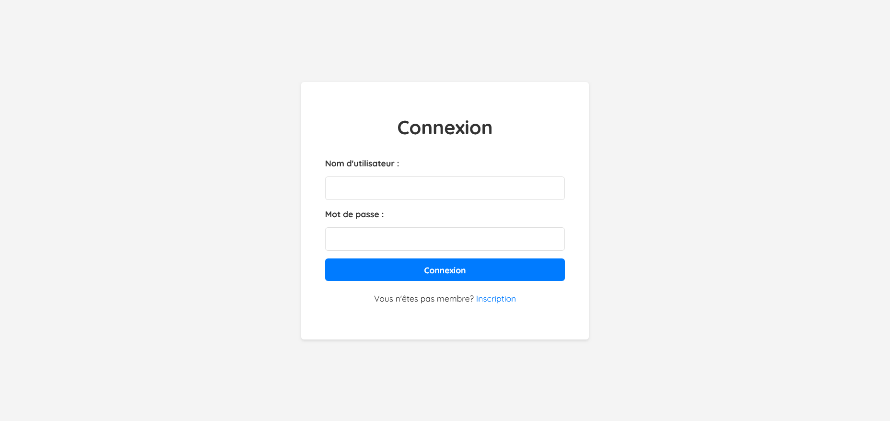
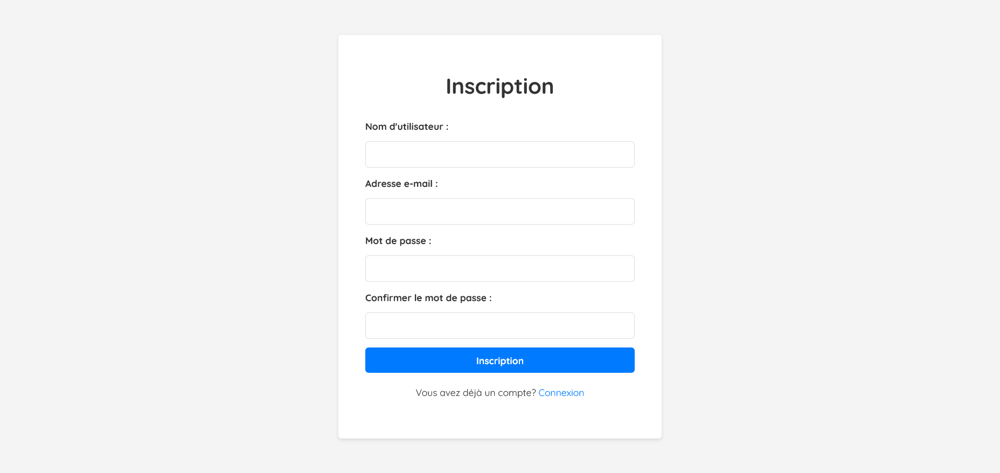
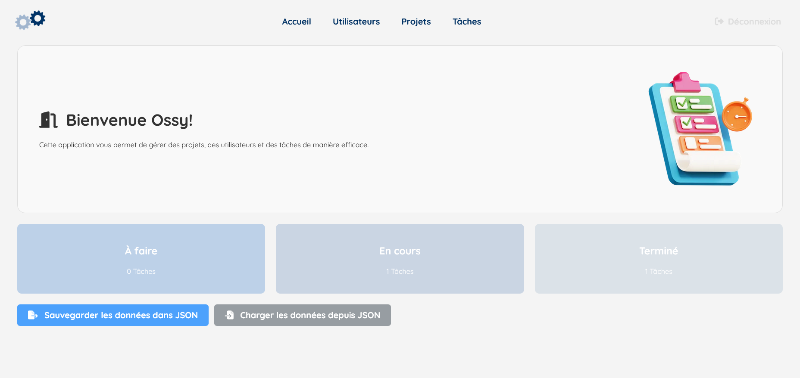
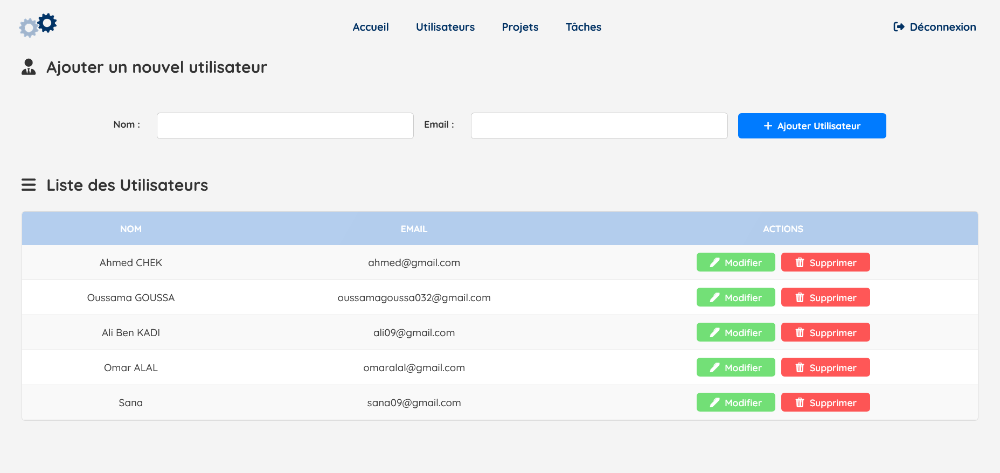
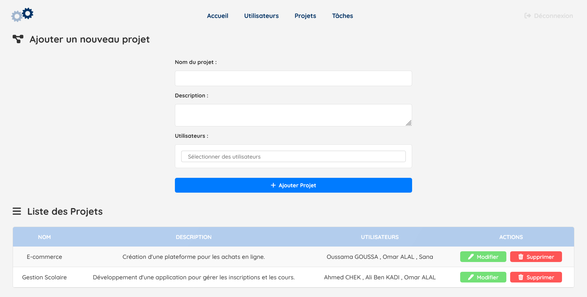
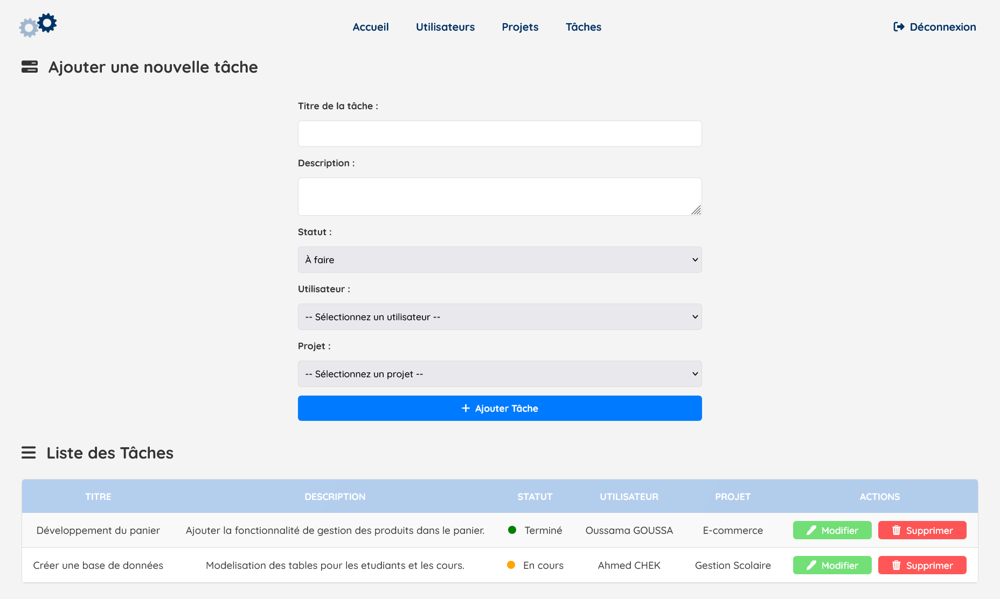

# 🚀 Gestion de Projets - Version Flask & SQLite

Une application web de gestion de projets développée avec **Flask** et **SQLite**, permettant de gérer des utilisateurs, projets et tâches de manière collaborative.


---

## 📋 Table des Matières

- [Fonctionnalités](#fonctionnalités)
- [Technologies Utilisées](#technologies-utilisées)
- [Installation](#installation)
- [Structure du Projet](#structure-du-projet)
- [Captures d'Écran](#captures-décran)
- [Utilisation](#utilisation)
- [Auteur](#auteur)

---

## ✨ Fonctionnalités

### 🔐 Authentification
- Connexion et inscription sécurisées
- Gestion de session utilisateur
- Déconnexion

### 👥 Gestion des Utilisateurs
- Ajout, modification et suppression d'utilisateurs
- Validation des emails uniques
- Interface administrative

### 📊 Gestion des Projets
- Création et modification de projets
- Association de multiples utilisateurs aux projets
- Suppression avec confirmation

### ✅ Gestion des Tâches
- Création de tâches avec statuts (À faire, En cours, Terminé)
- Assignation aux utilisateurs et projets
- Interface dynamique avec AJAX

### 💾 Sauvegarde & Chargement
- Export des données en JSON
- Import depuis des fichiers JSON
- Persistance des données avec SQLite

---

## 🛠 Technologies Utilisées

- **Backend:** Python, Flask
- **Base de Données:** SQLite
- **Frontend:** HTML5, CSS3, JavaScript
- **Autres:** AJAX, JSON, Sessions Flask

---

## ⚙️ Installation

### Prérequis
- Python 3.8+
- pip

### Étapes d'installation

1. **Cloner le repository**
```bash
git clone https://github.com/votre-username/Gestion-de-Projets.git
cd Gestion-de-Projets/flask_gestion_projets
```

2. **Créer un environnement virtuel**
```bash
python -m venv venv
source venv/bin/activate  # Linux/Mac
# ou
venv\Scripts\activate     # Windows
```

3. **Installer les dépendances**
```bash
pip install -r requirements.txt
```

4. **Lancer l'application**
```bash
python app.py
```

5. **Accéder à l'application**
Ouvrez votre navigateur et allez sur : `http://localhost:5000`

---

## 📁 Structure du Projet

```
flask_gestion_projets/
│
├── app.py                 # Point d'entrée principal
├── config.py              # Configuration Flask
├── requirements.txt       # Dépendances Python
│
├── routes/                # Gestion des routes
│   ├── projets.py
│   ├── utilisateurs.py
│   └── taches.py
│
├── models/                # Modèles de données
│   ├── utilisateur.py
│   ├── projet.py
│   ├── tache.py
│   └── db.py
│
├── utils/                 # Utilitaires
│   └── gestion_fichiers.py
│
├── templates/             # Templates HTML
│   ├── base.html
│   ├── index.html
│   ├── projets.html
│   ├── utilisateurs.html
│   └── taches.html
│
├── static/                # Fichiers statiques
│   ├── css/style.css
│   ├── js/script.js
│   └── img/
│
└── projets.json           # Données d'exemple
```

---

## 📸 Captures d'Écran

### 🔐 Page de Connexion

*Interface d'authentification sécurisée*

### 📝 Page d'Inscription  

*Formulaire de création de compte*

### 🏠 Page d'Accueil

*Tableau de bord avec aperçu des tâches*

### 👥 Gestion des Utilisateurs

*Interface de gestion des utilisateurs*

### 📊 Gestion des Projets

*Liste et gestion des projets*

### ✅ Gestion des Tâches

*Assignation et suivi des tâches*

---

## 🚀 Utilisation

1. **Créer un compte** via la page d'inscription
2. **Se connecter** avec vos identifiants
3. **Ajouter des utilisateurs** dans la section dédiée
4. **Créer des projets** et associer des membres
5. **Assigner des tâches** avec différents statuts
6. **Sauvegarder/Charger** vos données selon besoin

---

## 👨‍💻 Auteur

**GOUSSA Oussama**  
Étudiant en Ingénierie Informatique et Systèmes Embarqués (IISE)  
Année Universitaire 2024/2025

---

## 📄 Licence

Ce projet est développé dans un cadre académique.

---

**⭐ N'hésitez pas à donner une étoie au projet si vous le trouvez utile !**


